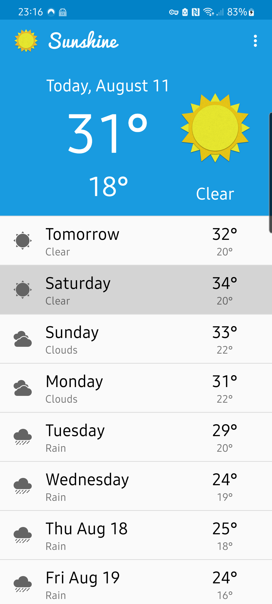
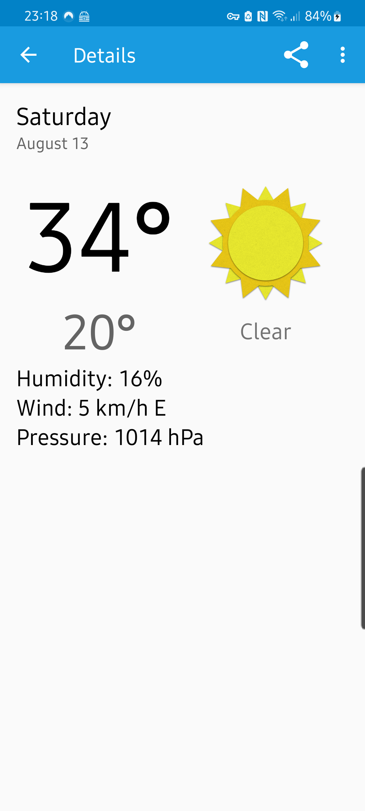

# Sunshine
Sunshine app created through "Developing Android Apps" course on Udacity. Application displays weather forecast for a given location. Weather data is received from OpenWeatherMap.

*Each branch represents a lesson e.g. 2.0 relates to lesson 2 of the course

## Screenshots

### Open Weather Map API Key is required.

In order for the Sunshine app to function properly as of October 18th, 2015 an API key for openweathermap.org must be included with the build.

Obtain a key via the following [instructions](http://openweathermap.org/appid#use), and include the unique key for the build by adding the following line to [USER_HOME]/.gradle/gradle.properties

`MyOpenWeatherMapApiKey="<UNIQUE_API_KEY">`

